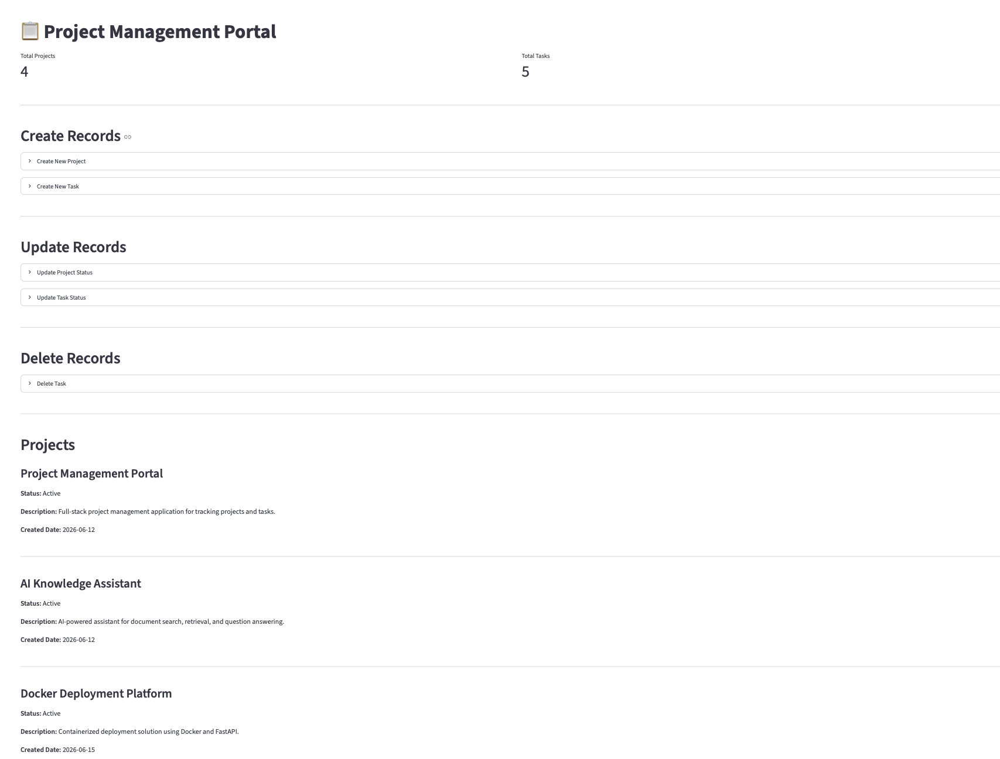
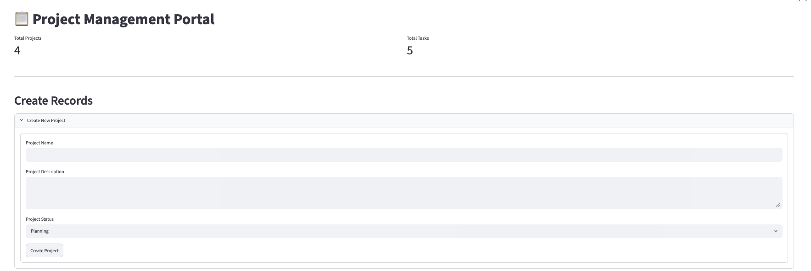
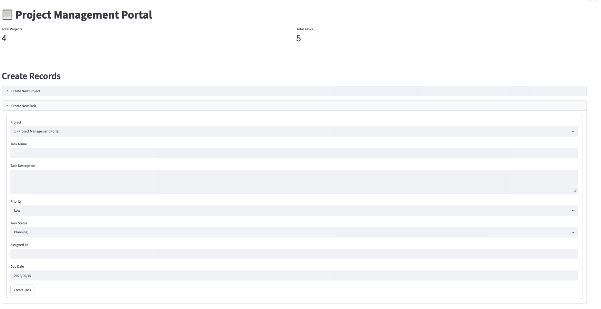

# 📋 Project Management Portal

## Overview

The Project Management Portal is a full-stack software engineering application designed to simulate a real-world project and task management platform.

The application enables users to create, view, update, and delete projects and tasks through an intuitive web interface while demonstrating modern software engineering architecture, REST API development, database integration, and frontend-to-backend communication.

This project showcases practical software engineering skills including:

* Application Architecture
* REST API Development
* Database Design
* CRUD Operations
* Frontend Development
* Backend Development
* GitHub Development Workflows

⸻
## 🏗️ Architecture

Streamlit Frontend 
⬇️ 
FastAPI REST API 
⬇️ 
Service Layer 
⬇️ 
SQLite Database

⸻
## 📸 Application Screenshots

### Streamlit Dashboard

### Create Project Form

### Create Task Form

### Swagger API Documentation

⸻

## 🚀 Key Features

### Project Management

* Create Projects
* View Projects
* Update Project Information
* Update Project Status
* Delete Projects

### Task Management

* Create Tasks
* View Tasks
* Update Task Information
* Update Task Status
* Delete Tasks

### Dashboard Functionality

* Total Project Metrics
* Total Task Metrics
* Project Status Tracking
* Task Status Tracking
* Interactive Streamlit User Interface

### API Functionality

* RESTful API Architecture
* FastAPI Endpoints
* Swagger / OpenAPI Documentation
* JSON Request and Response Handling

⸻

## 💻 Technology Stack

### Frontend

* Streamlit

### Backend

* Python
* FastAPI

### Database

* SQLite

### Development Tools

* Git
* GitHub
* PyCharm
* DBeaver

⸻

## 🔄 CRUD Operations

### Projects

| Operation | Endpoint |
| --- | --- |
| Create | POST /projects |
| Read | GET /projects |
| Read by ID | GET /projects/{project_id} |
| Update | PUT /projects/{project_id} |
| Delete | DELETE /projects/{project_id} |

### Tasks

| Operation | Endpoint |
| --- | --- |
| Create | POST /tasks |
| Read | GET /tasks |
| Read by ID | GET /tasks/{task_id} |
| Update | PUT /tasks/{task_id} |
| Delete | DELETE /tasks/{task_id} |
⸻

## 🎯 Skills Demonstrated

* Software Engineering
* Full-Stack Development
* REST API Development
* CRUD Operations
* Database Design
* Service Layer Architecture
* Frontend Development
* Backend Development
* API Integration
* Git Branching Strategy
* Pull Request Workflows
* Software Development Lifecycle (SDLC)

⸻

## ⭐ Project Highlights

* Designed and implemented a relational SQLite database
* Developed reusable service-layer business logic
* Built a complete FastAPI REST API
* Implemented Swagger/OpenAPI documentation
* Created a Streamlit frontend dashboard
* Connected frontend and backend through API integration
* Implemented full end-user CRUD functionality
* Managed development using GitHub Issues, feature branches, pull requests, and code reviews

⸻

## 🔮 Future Enhancements

* User Authentication
* Role-Based Access Control
* Dashboard Visualizations
* KPI Reporting
* Docker Containerization
* Cloud Deployment
* Automated Testing
* CI/CD Pipeline Integration

⸻

✅ Status

Version 2.0 — Complete

Project Status: ✅ Complete

This project demonstrates a complete full-stack software engineering application utilizing modern development practices, REST APIs, database integration, and end-user CRUD functionality.