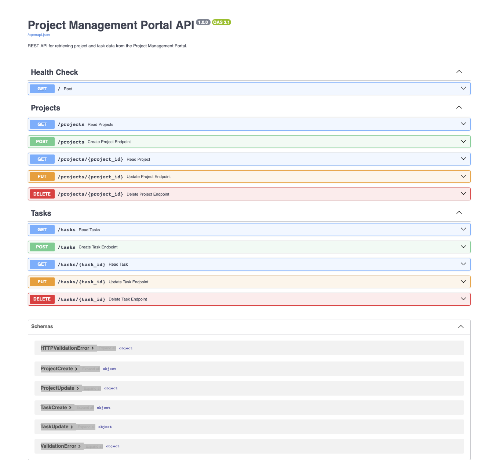

Project Management Portal

Overview

Project Management Portal is a full-stack software engineering application designed to simulate a real-world project and task management platform.

The application enables end users to create, view, update, and delete projects and tasks through an intuitive web interface while demonstrating modern software engineering architecture, REST API development, database integration, and frontend-to-backend communication.

This project was developed to showcase practical software engineering skills including application architecture, API development, CRUD operations, database design, and GitHub development workflows.

⸻

Architecture

Streamlit Frontend
        ↓
FastAPI REST API
        ↓
Service Layer
        ↓
SQLite Database

⸻
## Application Screenshots

### Streamlit Dashboard

### Create Project Form

### Create Task Form

### Swagger API Documentation

⸻

Key Features

Project Management

* Create projects
* View projects
* Update project information and status
* Delete projects through API endpoints

Task Management

* Create tasks
* View tasks
* Update task information and status
* Delete tasks

Dashboard Functionality

* Total project metrics
* Total task metrics
* Project status tracking
* Task status tracking
* Interactive Streamlit user interface

API Functionality

* RESTful API architecture
* FastAPI endpoints
* Swagger/OpenAPI documentation
* JSON request and response handling

⸻

Technology Stack

Frontend

* Streamlit

Backend

* Python
* FastAPI

Database

* SQLite

Development Tools

* Git
* GitHub
* PyCharm
* DBeaver

⸻

CRUD Operations

Projects

Operation	Endpoint
Create	POST /projects
Read	GET /projects
Read by ID	GET /projects/{project_id}
Update	PUT /projects/{project_id}
Delete	DELETE /projects/{project_id}

Tasks

Operation	Endpoint
Create	POST /tasks
Read	GET /tasks
Read by ID	GET /tasks/{task_id}
Update	PUT /tasks/{task_id}
Delete	DELETE /tasks/{task_id}

⸻

Skills Demonstrated

* Software Engineering
* Full-Stack Development
* REST API Development
* CRUD Operations
* Database Design
* Service Layer Architecture
* Frontend Development
* Backend Development
* API Integration
* Git Branching Strategy
* Pull Request Workflows
* Software Development Lifecycle (SDLC)

⸻

Project Highlights

* Designed and implemented a relational SQLite database
* Developed reusable service-layer business logic
* Built a complete FastAPI REST API
* Implemented Swagger/OpenAPI documentation
* Created a Streamlit frontend dashboard
* Connected frontend and backend through API integration
* Implemented full end-user CRUD functionality
* Managed development using GitHub Issues, feature branches, pull requests, and code reviews

⸻

Future Enhancements

* User Authentication
* Role-Based Access Control
* Dashboard Visualizations
* KPI Reporting
* Docker Containerization
* Cloud Deployment
* Automated Testing
* CI/CD Pipeline Integration

⸻

Status

Version 2.0 — Complete

Project Status: ✅ Complete

This project demonstrates a complete full-stack software engineering application utilizing modern development practices and end-user functionality.